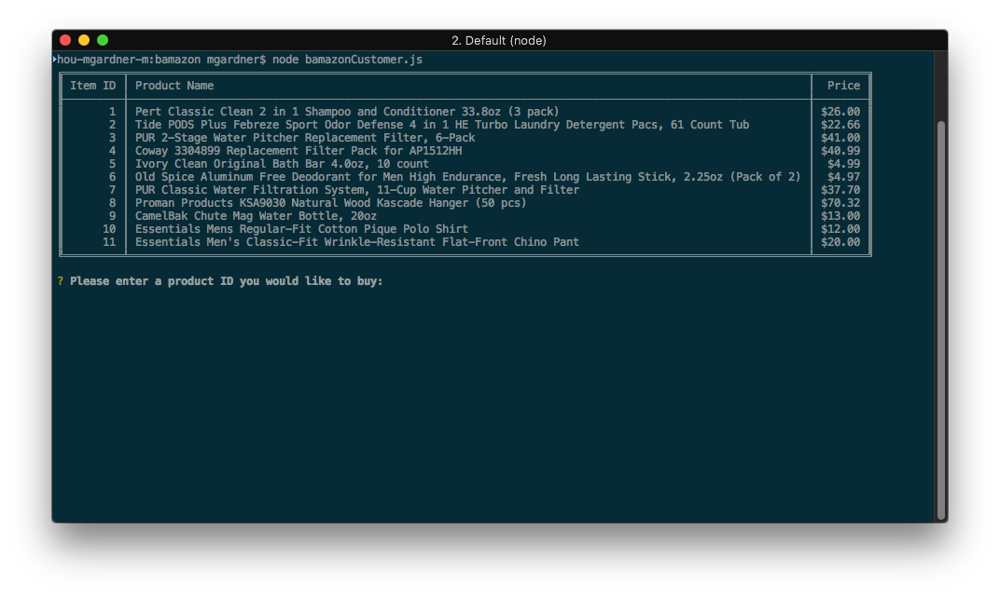
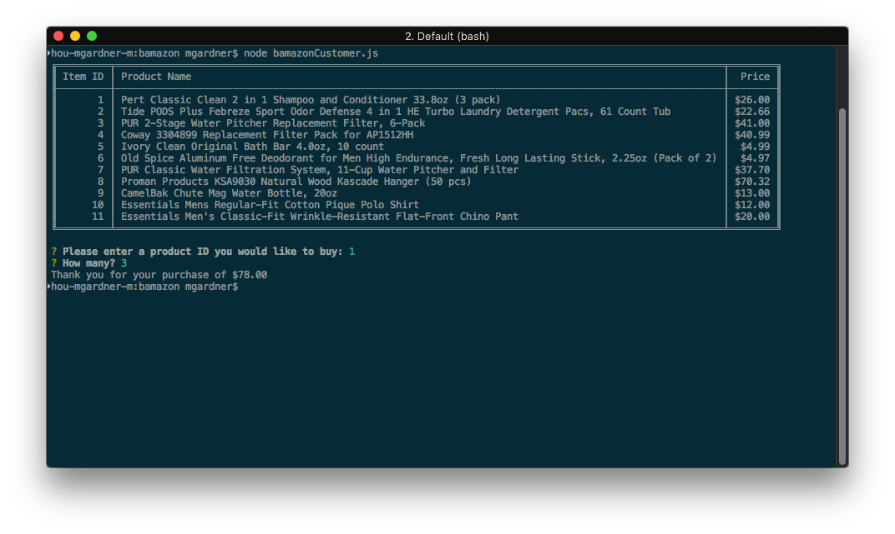

# bamazon

This is a small command-line application demonstrating usage of MySQL with
Node.js.

## Installation and setup

To install it, do the following:

```bash
cd bamazon
npm install
```

You also need MySQL running on the same machine (`localhost`) listening on
port 3306. Run the included SQL script `bamazon.sql` to create the bamazon
database and populate it with sample data. To specify the MySQL username and
password to use, create a file called `.env` in the same directory that
looks like this:

```
MYSQL_USER=<username>
MYSQL_PASSWORD=<password>
```

...filling in the `<username>` (can be `root`) and `<password>` with the
appropriate values. You can also specify these values as environment
variables.

## Running the application

To run the application, do the following:

```bash
node bamazonCustomer.js
```

A table containing product IDs, product names, and prices appears:


Below the table, you are prompted for a product ID. Selecting a valid product
then prompts you for how many to purchase. After entering a quantity, you're
informed of the total purchase price and returned to your command prompt.


Behind the scenes, the application has reduced the quantity stored in the
bamazon database. Users are prevented from buying more than the database
has in stock.

## Libraries used

* [dotenv](https://www.npmjs.com/package/dotenv)
* [inquirer](https://www.npmjs.com/package/inquirer)
* [mysql](https://www.npmjs.com/package/mysql)
* [table](https://www.npmjs.com/package/table)
