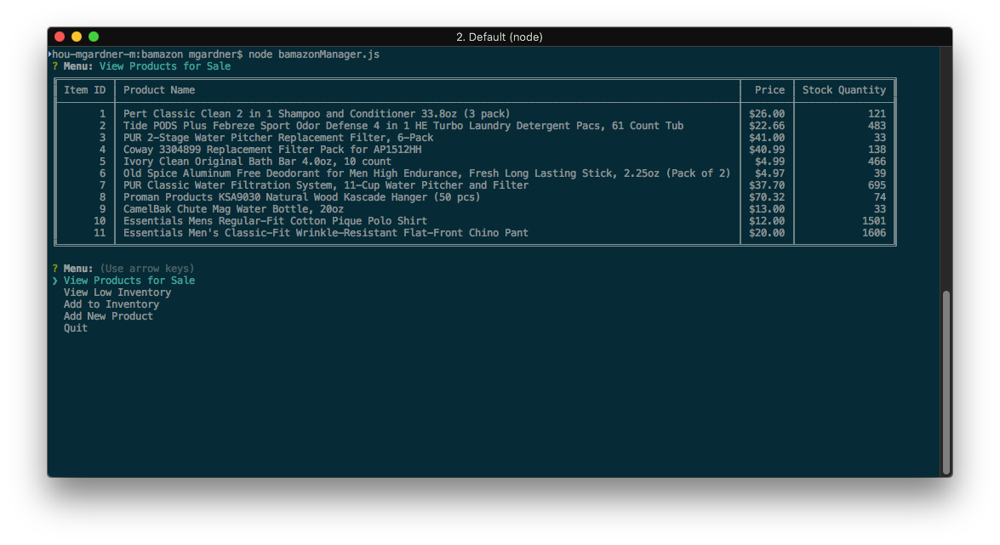
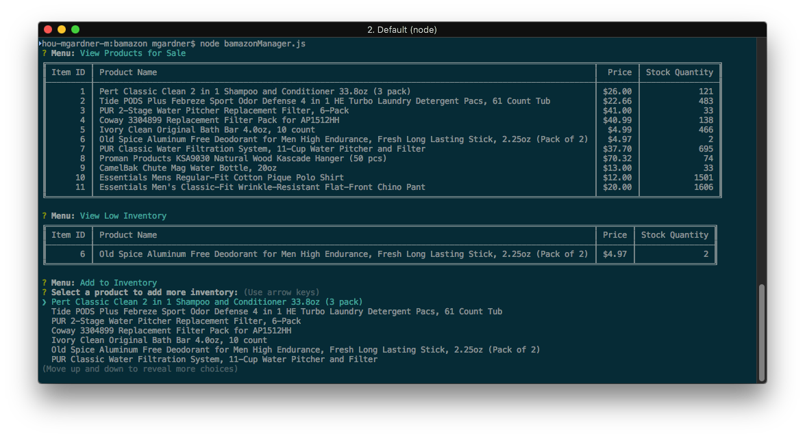
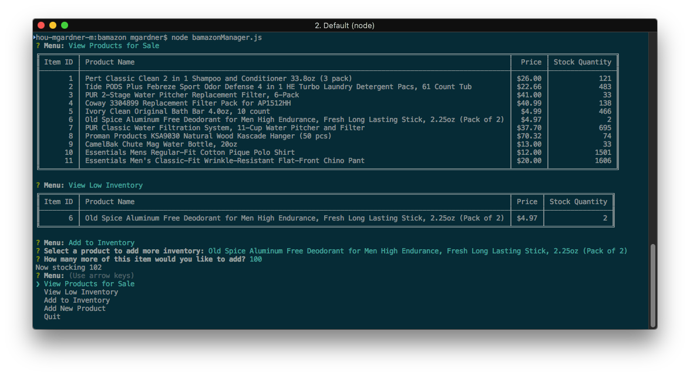
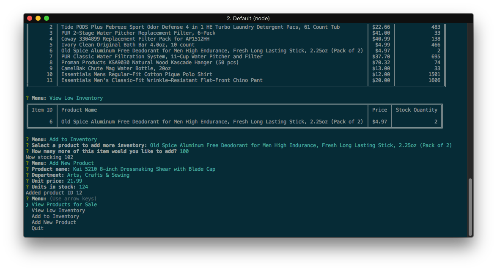

# bamazon

This is a small command-line application demonstrating usage of MySQL with
Node.js.

## Installation and setup

To install it, do the following:

```bash
cd bamazon
npm install
```

You also need MySQL running on the same machine (`localhost`) listening on
port 3306. Run the included SQL script `bamazon.sql` to create the bamazon
database and populate it with sample data. To specify the MySQL username and
password to use, create a file called `.env` in the same directory that
looks like this:

```
MYSQL_USER=<username>
MYSQL_PASSWORD=<password>
```

...filling in the `<username>` (can be `root`) and `<password>` with the
appropriate values. You can also specify these values as environment
variables.

## Running the customer application

To run the customer application, do the following:

```bash
node bamazonCustomer.js
```

A table containing product IDs, product names, and prices appears:


Below the table, you are prompted for a product ID. Selecting a valid product
then prompts you for how many to purchase. After entering a quantity, you're
informed of the total purchase price and returned to your command prompt.


Behind the scenes, the application has reduced the quantity stored in the
bamazon database. Users are prevented from buying more than the database
has in stock.

## Running the manager application

To run the manager application, do the following:

```bash
node bamazonManager.js
```

A menu of choices appears:


Use the arrow keys to select items from the menu. After performing a function, the menu
will reappear.

### View Products for Sale

Selecting *View Products for Sale* displays all products, including their ID, name,
unit price, and stock quantity.


### View Low Inventory

Selecting *View Low Inventory* will eother yield a message indicating there is no low
inventory...


...or a table of products with a stock quantity less than 5.


### Add to Inventory

Selecting *Add to Inventory* presents a scrolling menu of products to which you may
add more stock.


After selecting a product, you may type in how many more of the product you wish to stock.
A total stock count is then displayed.


### Add New Product

The *Add New Product* selection enables you to add new products into the database. You
will be prompted for produt name, department name, unit price, and units in stock. The
new product ID is then printed.


### Quit

Finally, the *Quit* menu item quits the application and returns you to your command
prompt.


## Libraries used

* [dotenv](https://www.npmjs.com/package/dotenv)
* [inquirer](https://www.npmjs.com/package/inquirer)
* [mysql](https://www.npmjs.com/package/mysql)
* [table](https://www.npmjs.com/package/table)
